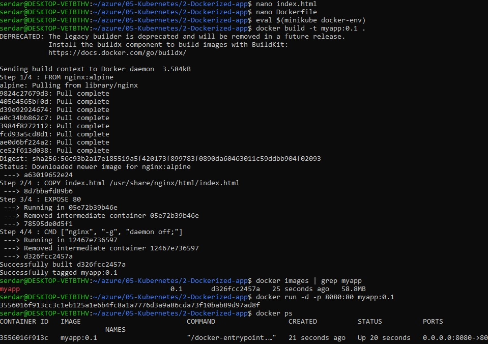
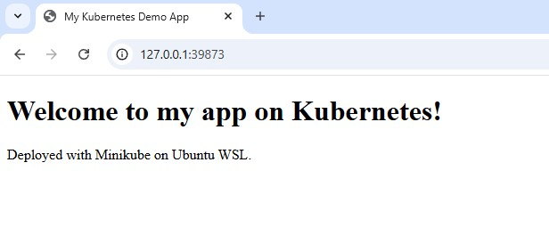

# Deploying a Dockerized App to Kubernetes
1. Connect Docker to Minikube's environment
2. Build the Docker image
3. Create Deployment and Service files
4. Access the app

## Connect Docker to Minikube and Build the Docker Image
Connecting Minikube's environment makes the Docker command use the Docker daemon inside Minikube
```bash
eval $(minikube docker-env)
```
Build the Docker image
```bash
docker build -t myapp:0.1 .
```
Verify
```bash
docker images | grep myapp
```


## Create Deployment and Service Files and Access to the App

### Create the Deployment File
Create deployment.yaml
```yaml
apiVersion: apps/v1
kind: Deployment
metadata:
  name: myapp
  labels:
    app: myapp
spec:
  replicas: 2
  selector:
    matchLabels:
      app: myapp
  template:
    metadata:
      labels:
        app: myapp
    spec:
      containers:
      - name: myapp
        image: myapp:0.1
        imagePullPolicy: IfNotPresent
        ports:
        - containerPort: 80
```
Apply the Deployment file
```bash
kubectl apply -f deployment.yaml
```
Check the file
```bash
kubectl get deploy
kubectl get pods
```

### Create the Service File
Create service.yaml
```yaml
apiVersion: v1
kind: Service
metadata:
  name: myapp
spec:
  type: NodePort
  selector:
    app: myapp
  ports:
  - protocol: TCP
    port: 80
    targetPort: 80
    nodePort: 30080
```
Apply the Service file
```bash
kubectl apply -f service.yaml
```
Check the file
```bash
kubectl get svc
```

### Access the App
Get the URL
```bash
minikube service myapp --url
```

Open the URL in your browser

